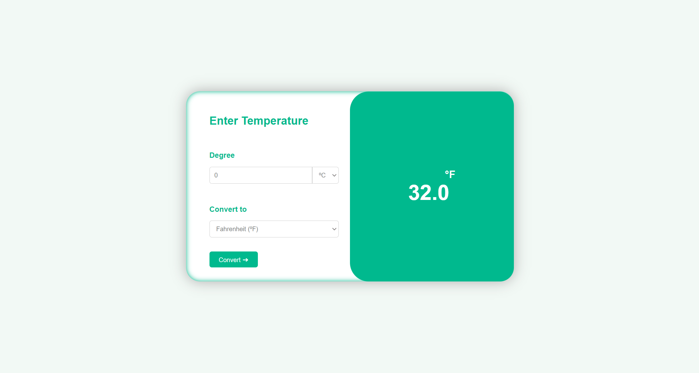

# Temperature Converter

A beautifully designed web application for converting temperatures between Celsius, Fahrenheit, and Kelvin.

## Introduction

This project is a web-based temperature converter that not only provides accurate conversions but also offers a visually appealing and user-friendly interface. The layout is clean and responsive, ensuring that users can easily interact with the converter on any device.

## Features

- **Intuitive Design:** The user interface is designed to be intuitive, allowing users to quickly understand how to use the converter.
- **Real-time Updates:** The converter updates the converted temperature in real-time as the user inputs values or changes the selected units.
- **Responsive Layout:** The layout is responsive, ensuring that the converter looks great and functions well on both desktop and mobile devices.
- **Cross-browser Compatibility:** The project is developed using HTML, CSS, and JavaScript to ensure cross-browser compatibility and a smooth user experience.

## Technologies Used

- **HTML5:** Used for structuring the web page.
- **CSS3:** Used for styling the user interface.
- **JavaScript:** Used for implementing the conversion logic and interactivity.

## Usage
1. Enter a temperature value in the input field labeled "Degree".
2.  Select the unit of the entered temperature (Celsius, Fahrenheit, or Kelvin) from the dropdown menu.
3. Select the desired unit to convert to from the second dropdown menu labeled "Convert to".
4. The converted temperature will be displayed in the "Converted Degree" section.

## Screenshot
Here is a screenshot of my project

